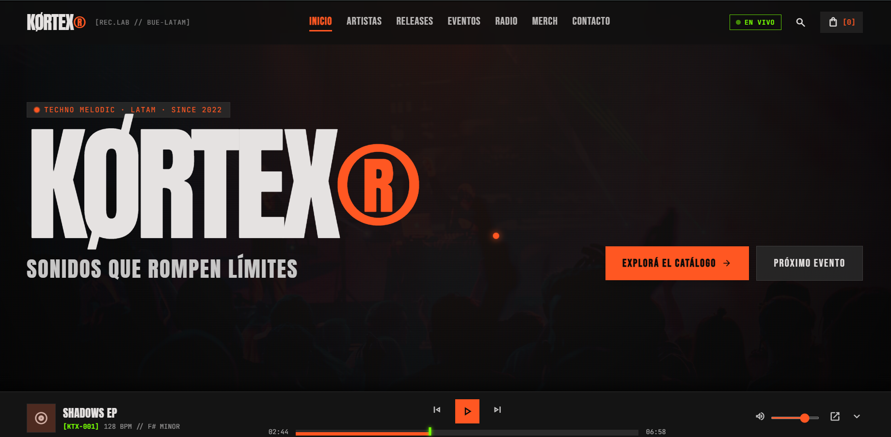

# KØRTEX Records

Sitio web de un sello de techno melódico latinoamericano, con estética editorial de agencia creativa y motion guiado por el scroll.

**Demo en vivo → [juantrezza.github.io/kortex-records](https://juantrezza.github.io/kortex-records/)**



## Qué hace

- **Roster de artistas** en bento grid, con filtro por región y modal de perfil de cada artista.
- **Releases, radio y eventos**: catálogo con preview en el reproductor, fechas con countdown y waitlist para las agotadas, y filtro por ciudad (también desde el mapa de presencia LATAM).
- **Tienda de merch** con selección de talle y carrito persistente en `localStorage` (el checkout es simulado).
- **Reproductor fijo** con play/pausa, seek, volumen, anterior/siguiente y modo minimizado. La reproducción es simulada con un timer: no carga audio real.
- **Búsqueda global** de artistas, releases y eventos.
- **Formularios** de newsletter y envío de demos con validación básica (sin backend).

## Decisiones de diseño y técnicas

- **Lenis + GSAP en un solo loop.** Lenis no usa su propio `requestAnimationFrame`: lo mueve `gsap.ticker` y cada frame de scroll actualiza ScrollTrigger, así el scroll suave y las animaciones nunca se desfasan. Las animaciones usan `useGSAP` (se limpian al desmontar) y `gsap.matchMedia`, así en mobile los movimientos son más cortos y no hay parallax.
- **Scroll sin re-renders.** La barra de progreso se suscribe a Lenis y actualiza `scaleX` por `ref`. La versión anterior hacía `setState` en cada evento de scroll y volvía a renderizar toda la app.
- **Modales y reduced-motion.** Un hook con contador (`useLenisLock`) pausa Lenis mientras hay un modal, el carrito o el menú abiertos, y `data-lenis-prevent` deja scrollear sus listas internas. Con `prefers-reduced-motion` no se inicializa Lenis, no se crean animaciones de scroll, los marquees quedan quietos y se desactivan las animaciones de entrada de los modales.
- **Marquees continuos y reactivos.** Cada marquee tenía dos tracks que se movían −50% de su propio ancho, lo que producía un salto al reiniciar. Ahora se mueven un ancho completo (−100%) con GSAP, y su velocidad y dirección siguen a la velocidad del scroll.
- **Estado sin librerías externas.** Carrito, reproductor y toasts viven en hooks propios (`useCart`, `useAudioPlayer`, `useToast`); el contenido es estático en `src/data/`, así el sitio se despliega como estático en GitHub Pages.

## Stack

React 19 + TypeScript · Vite · Tailwind CSS 3 (+ tailwindcss-animate) · GSAP (ScrollTrigger, SplitText) + Lenis · GitHub Actions → GitHub Pages

## Correrlo localmente

```bash
git clone https://github.com/JuanTrezza/kortex-records.git
cd kortex-records
npm install
npm run dev   # http://localhost:3000/kortex-records/
```

## Estructura

```
src/
├── components/   # secciones, modales, carrito y reproductor
├── hooks/        # carrito, reproductor, toasts, scroll y motion
├── lib/          # motion.ts: Lenis + GSAP + ScrollTrigger
├── data/         # contenido estático (artistas, releases, eventos, merch, radio)
└── types/
```

## Autor

**Juan Moreno Trezza** — [Portfolio](https://juantrezza.github.io/porfolio/) · [LinkedIn](https://www.linkedin.com/in/juanmorenotrezza/) · [GitHub](https://github.com/JuanTrezza)

Proyecto de portfolio: los artistas, sellos y marcas que aparecen se usan a modo ilustrativo.
